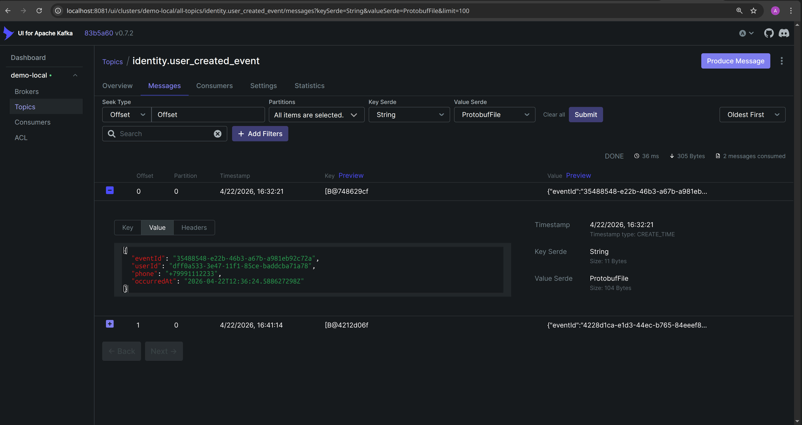
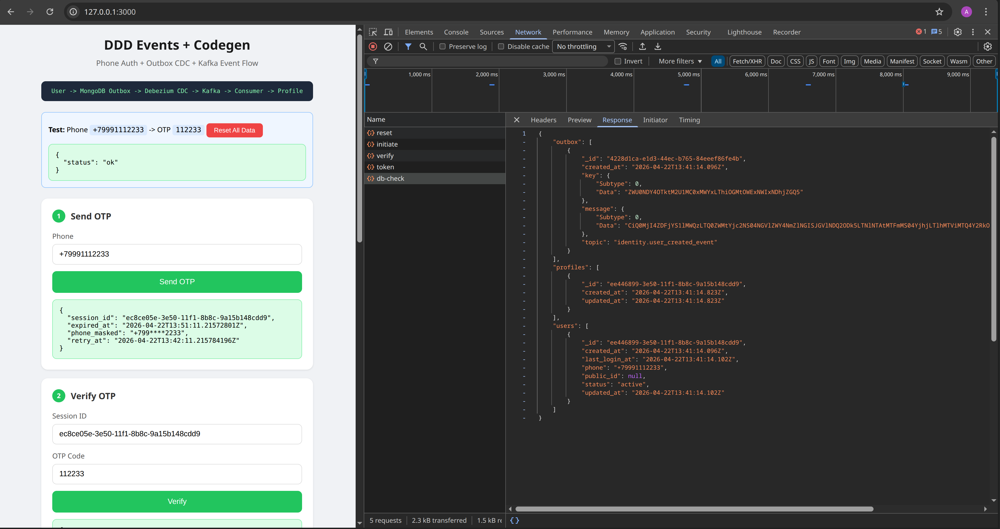

# Proto-структура = доменное событие

В типичном Go-сервисе каждое доменное событие требует struct, конвертер в proto и строку в dispatch-map. На 7 событий это [~360 строк бойлерплейта](docs/converter-tax.md). Конвертер порождает тесты, которые существуют только потому что существует конвертер. Dispatch-map на reflect это `switch`, где забытая строка становится рантайм-ошибкой.

Здесь proto-struct **является** событием. `_ext.go` добавляет метаданные, топик берётся из proto-опции, `proto.Marshal` даёт байты. Вдохновлено [cosmos-sdk](https://github.com/cosmos/cosmos-sdk).

## Идея в пяти файлах

| Файл | Что делает |
|------|------------|
| [`proto/common/kafka.proto`](proto/common/kafka.proto) | Custom option `(common.topic).value` на `MessageOptions` |
| [`proto/identity/events.proto`](proto/identity/events.proto) | Событие с аннотацией `option (common.topic).value = "..."` |
| [`pb/identity/events_ext.go`](pb/identity/events_ext.go) | `EventID()`/`AggregateID()`/`OccurredAtTime()` на сгенерированной proto-struct (hand-written) |
| [`pkg/kafka/topic.go`](pkg/kafka/topic.go) | `GetTopic(proto.Message)` достаёт топик из descriptor в рантайме |
| [`pkg/outbox/publisher.go`](pkg/outbox/publisher.go) | `proto.Marshal` + `GetTopic` без обёртки на каждое событие |

Остальное это обвязка под реалистичный домен: OAuth2 OTP, hex-арх, два bounded context (`Identity` публикует, `Profile` потребляет).

## Без конвертера тестируем поведение, а не маппинг

`proto.Marshal` гарантирован кодогеном, топик лежит в дескрипторе. Остаётся тестировать бизнес-логику:

```go
user, _ := model.NewUser(phone)
events := user.PopEvents()
require.NotEmpty(t, events)
```

Проверять поля события (`assert.Equal(t, phone, event.GetPhone())`) тоже не нужно. Опечатываться негде, потому что нет конвертера.

## Flow

```
proto/identity/events.proto
      ↓ easyp generate
pb/identity/events.pb.go         Marshal/Unmarshal
pb/identity/events_ext.go        доменные методы (hand-written)
      ↓ pkg/outbox/publisher.go
MongoDB outbox
      ↓ Debezium MongoEventRouter + ByteArrayConverter (proto-байты как есть)
Kafka → Consumer[T proto.Message] → handler
```

В connector-конфиге обязателен `ByteArrayConverter`, иначе Debezium переконвертирует proto-байты в JSON.

## Kafka UI видит protobuf

Kafka UI десериализует protobuf в браузере. Нужно прокинуть `.proto` и указать маппинг в `cmd/api/docker/kafka-ui-config.yaml`:

```yaml
serde:
  - name: ProtobufFile
    properties:
      protobufFilesDir: /kafka-protos
      protobufMessageNameByTopic:
        identity.user_created_event: identity.UserCreatedEvent
```



## Запуск

```bash
cd cmd/api && docker compose up -d
sleep 30 && ./scripts/debezium.sh create-all
go run ./cmd/demo     # UI :3000; API уже в контейнере :8080
```

Для проверки: телефон `+79991112233`, OTP `112233`, Client ID `1`.



## Бонус

Гайд по [exactly-once с Debezium и Kafka Connect](docs/eos-debezium.md). В демо не реализовано.
